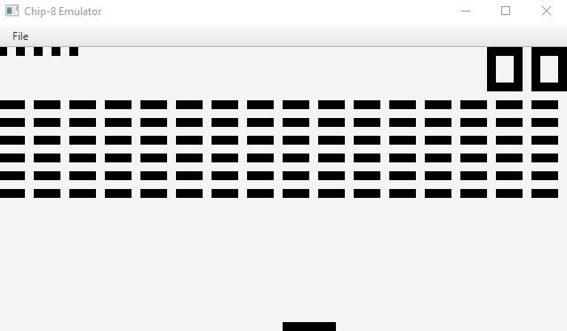

# Chip-8 emulator

### Build

> ./gradlew build

### Run

> ./gradlew run

### Guide

Program files can be loaded through the file menu or by drag-and-dropping the file on top of the emulator.

The image below shows how the keys 0-F are mapped on the numpad. 

